# har2sequence

## Overview
`har2sequence` is a tool designed to convert HTTP Archive (HAR) files into sequence diagrams. This project aims to help visualize HTTP interactions by generating sequence diagrams based on the information contained in HAR files.

## Features
- **Load HAR files**: Parses HAR files to extract HTTP request and response data.
- **Generate sequence diagrams**: Creates sequence diagrams from HAR data using mermaid.js, illustrating the flow of HTTP requests and responses.
- **Configuration support**: Allows customization of participants, excluded paths, and message prefixes through a YAML configuration file.

## Installation

You can download the pre-built binary for your operating system and architecture using `curl` or `wget` and place it in a directory that is included in your system's `PATH`. Replace `<your-os-and-arch>` with the appropriate value (e.g., `linux-amd64`, `win-amd64`, `macos-arm64`). `<your-PATH-directory>` represents any directory that is included in the environment variable `$PATH`. This directory is one of the locations the system searches when looking for executable commands.

```sh
curl -L -o /<your-PATH-directory>/har2sequence https://github.com/tasuku43/har2sequence/releases/download/v0.1.0/har2sequence-<your-os-and-arch>
chmod +x /<your-PATH-directory>/har2sequence
```

### Example for Linux (64-bit amd64)

```sh
curl -L -o /usr/local/bin/har2sequence https://github.com/tasuku43/har2sequence/releases/download/v0.1.0/har2sequence-linux-amd64
chmod +x /usr/local/bin/har2sequence
```

### Download Links for Other Platforms

- https://github.com/tasuku43/har2sequence/releases/download/v.0.1.0/har2sequence-linux-arm64
- https://github.com/tasuku43/har2sequence/releases/download/v.0.1.0/har2sequence-linux-amd64
- https://github.com/tasuku43/har2sequence/releases/download/v.0.1.0/har2sequence-macos-amd64
- https://github.com/tasuku43/har2sequence/releases/download/v.0.1.0/har2sequence-macos-arm64
- https://github.com/tasuku43/har2sequence/releases/download/v.0.1.0/har2sequence-win-amd64.exe
- https://github.com/tasuku43/har2sequence/releases/download/v.0.1.0/har2sequence-win-arm64.exe
```

## Usage
You can run `har2sequence` with the following command:

```sh
har2sequence -config <path_to_config_file> -har <path_to_har_file>
```

### Example
```sh
har2sequence -config config.yaml -har example.har
```

## Configuration
The configuration file is written in YAML format. Here is an example `config.yaml`:

```yaml
participants:
  - "example.com"
  - "api.example.com"
excludePaths:
  - "example.com/exclude-this-path"
  - "api.example.com/exclude-this-path"
messagePrefixes:
  GET: "🟢 "
  POST: "🟠 "
  PUT: "🟣 "
  PATCH: "🟡 "
  DELETE: "🔴 "
```

### Config Parameters
- **participants**: List of domain participants to include in the sequence diagram.
- **excludePaths**: List of URL paths to exclude from the sequence diagram.
- **messagePrefixes**: Map of HTTP methods to prefixes used in the sequence diagram.

## Case Study: Generating a Sequence Diagram for Google's Homepage

To demonstrate how `har2sequence` works, we'll use a HAR file captured from accessing Google's homepage. We'll configure the tool to focus on specific participants and exclude unnecessary paths.

### Configuration File Example

Here is the `config.yaml` file we will use:

```yaml
participants:
  - "www.google.com"
  - "ogs.google.com"
excludePaths:
  - "www.google.com/js"
  - "www.google.com/xjs"
  - "www.google.com/images"
  - "www.google.com/gen_204"
messagePrefixes:
  GET: "🟢 "
```

### Generating the Sequence Diagram

Run the following command with the configuration file and the HAR file:

```sh
har2sequence -config config.yaml -har ./www.google.com.har
```

### Example Output

The command will produce a sequence diagram in the following format:

```mermaid
sequenceDiagram
    participant Browser
    participant www.google.com
    participant ogs.google.com
    Browser->>www.google.com: 🟢 GET /
    activate www.google.com
    www.google.com-->>Browser: 200
    deactivate www.google.com
    Browser->>www.google.com: 🟢 GET /complete/search
    activate www.google.com
    www.google.com-->>Browser: 200
    deactivate www.google.com
    Browser->>www.google.com: 🟢 GET /client_204
    activate www.google.com
    www.google.com-->>Browser: 204
    deactivate www.google.com
    Browser->>www.google.com: 🟢 GET /async/hpba
    activate www.google.com
    www.google.com-->>Browser: 200
    deactivate www.google.com
    Browser->>ogs.google.com: 🟢 GET /u/0/widget/app
    activate ogs.google.com
    ogs.google.com-->>Browser: 200
    deactivate ogs.google.com
```



In this output:
- **Browser** represents the client's browser.
- **www.google.com** and **ogs.google.com** are the participants defined in the configuration file.
- The arrows (`->>`) indicate HTTP requests from the browser to the servers.
- The `activate` and `deactivate` keywords show the periods during which each participant is active.
- The custom message prefix "🟢 " is used for `GET` requests as specified in the configuration file.

This sequence diagram is generated using mermaid.js, making it easy to visualize the flow of HTTP requests and responses when accessing Google's homepage.

## Dependencies
This project uses the following dependencies:
- `gopkg.in/yaml.v2`: For parsing YAML configuration files.

## License
This project is licensed under the MIT License. See the [LICENSE](https://github.com/tasuku43/har2sequence/blob/main/LICENSE) file for details.
